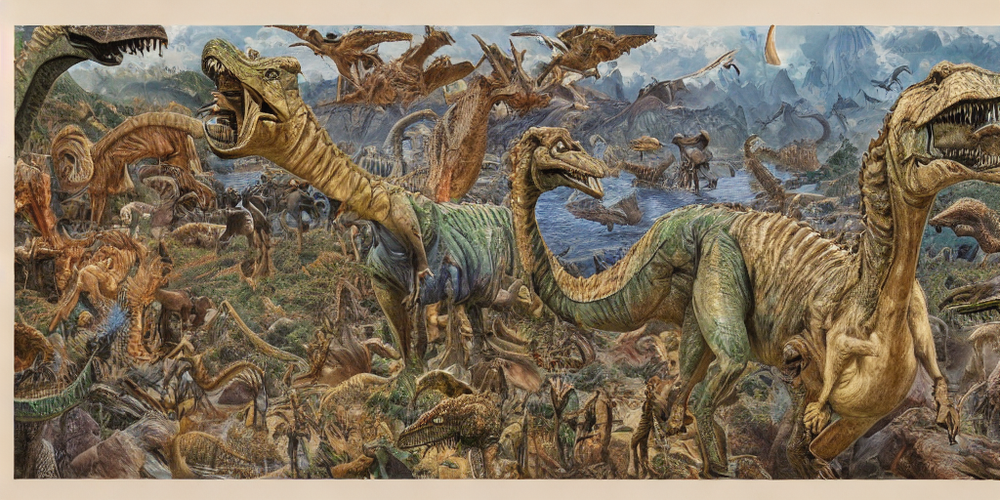
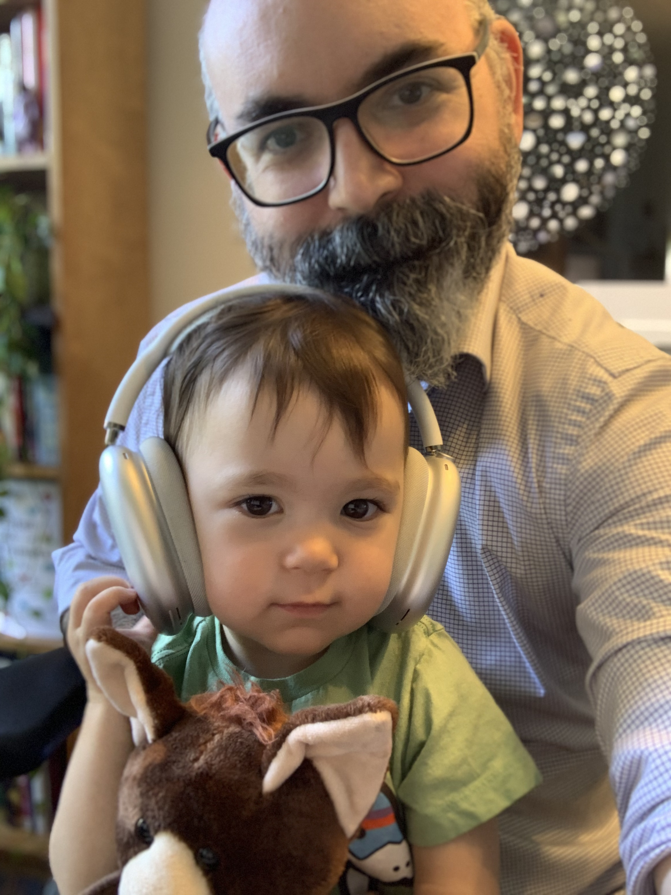

This page intentionally left blank. ⬇️, ➡️, or spacebar 🛰 to start slidedeck.
---
class: center, middle


# Welcome to 654!

--

Or should I say...


---


class: center, middle

```
 _    _      _                            _           ____  _____    ___ _
| |  | |    | |                          | |         / ___||  ___|  /   | |
| |  | | ___| | ___ ___  _ __ ___   ___  | |_ ___   / /___ |___ \  / /| | |
| |/\| |/ _ \ |/ __/ _ \| '_ ` _ \ / _ \ | __/ _ \  | ___ \    \ \/ /_| | |
\  /\  /  __/ | (_| (_) | | | | | |  __/ | || (_) | | \_/ |/\__/ /\___  |_|
 \/  \/ \___|_|\___\___/|_| |_| |_|\___|  \__\___/  \_____/\____/     |_(_)


```
---

## The basics

**Section**: INFO 654-04  
**Credits**: 3  
**Day and Time**: Wednesday 06:30PM - 09:20PM  Eastern Time  
**Location**:  Manhattan - W14, Room 606

## Your instructor

- Josh Hadro (please call me "Josh", pronouns are he/him/his)
  - Email and phone in syllabus

---
How I generally structure class (`Meta-structure!`):

- Attendance
- Agenda
- News of the Week
- Weekly readings
- BREAK!
- Usually a little bit of didactic whatever
- BREAK!
- Then more discussion, or a guest, or a lab

---

## TODAY’s AGENDA
- Meta-agenda

--

.center[]

---
## TODAY’s AGENDA
- Meta-agenda (mind blown!)
- Intro
- Instructor
  - Who I am
- Who you are
- Syllabus
  - Course Philosophy
- Assignments
- Break!
- WordPress blog
  - Categories! Important!


---

## How this semester will work  

A lot like the last few semesters...

--

# ` ¯\_(ツ)_/¯  `

---
class: center, middle

# We will figure it out together

--

## And we do have a plan

---

## Tools

- [WordPress](https://lis654fa22.wordpress.com/)
- Slides ([remark.js](https://github.com/gnab/remark))
- [Etherpad](https://etherpad.wikimedia.org/p/prattsi654fa22-1)
- Good old email

---

Before we get to the first in-class exercise...

# What questions do you have so far?


---

## First class exercise

Who are you?
Introduce yourselves to us and each other!

- What you've taken at Pratt so far, if anything
- what brought you to Pratt Info school
- day job or relevant experience (if any; ok if not!)
- any specific interests you might have for this course

---
class: center, middle

## I will go first

---
class: center, middle

### Josh
<!--  -->


---
class: center, middle


---
class: center, middle


---

class: center, middle


---

class: center, middle


---
class: center, middle


`"IIIF + dinosaurs, by James Gurney"`


---
class: center, middle



`"IIIF + dinosaurs, by James Gurney"`

---

class: center, middle


`"a portrait of Tom Hanks eating a potato, by Annie Leibovitz"`


---
class: center, middle



---

## Your Turn

### Very briefly: 

- What you've taken at Pratt so far, if anything
- what brought you to Pratt Info school
- day job or relevant experience (if any; ok if not!)
- any specific interests you might have for this course


---
class: center, middle

# Break!

---
class: center, middle

# Syllabus

---

# But first...

## Information Technologies Course Waiver

--
Give this some thought, and make the most of your time+$ at Pratt!

---

# Syllabus

The canonical version of the syllabus lives in our class Github repository:
[INFO 654-04 Syllabus](https://hadro.github.io/info654fa22/syllabus/)

--
## We'll go section by section

---

## Note

Before we get to the syllabus, a quick note:

I come from a library/archives background.

But when I say "library", that doesn't always just mean library -- for the most part, I mean GLAM and information professions more broadly!

(We'll make it clear when we mean libraries/archives/museums/UX roles as completely distinct)

---

## One part of class philosophy:

You are entering a set of professions. we're not training you to be network admins or coders per se, but rather good professional colleagues in these professions who are totally and completely conversant in the languages of technology. That means being able to talk to peers and colleagues and end users about any and all relevant technology issues.

And, as you'll see this semester, this notion of "technology" really infuses every aspect of daily life, professional and personal.

---

## Class Norms

This isn't all a one-way street.
You have as much to learn from your peers and colleagues in this class as you do from us (maybe more, over the long-term!)

While the assignments, other than the presentation assignment, don't require group work or co-working, we'll try to make this work during the lab sections of the class, and we encourage you to use Slack and other spaces to make connections with your peers.

---

# Assignments

- News of the Week
- [Inspiration posts](https://hadro.github.io/info654fa22/assignments/reflection_and_inspiration_posts)
- [Reflection posts](https://hadro.github.io/info654fa22/assignments/reflection_and_inspiration_posts#reflection-posts)
- Personal Homepage project
- Blank Technology Canvas project
  - Presentation
  - Final report

---

Before we get to the next in-class exercise...

# What questions do you have so far?

Questions about the first assignments?

---
class: center, middle

# In-class exercise


---

## WordPress


--

1. Accept WordPress invitation
  - Confirm you have access to posting, since this is where some assignments are due
2. Fill out form on homepage of class WordPress sites
3. Go eat dinner/sleep/read a book etc!

---

## 1. Accept WordPress invitation


Make sure you have access to these two pages:
- <https://lis654fa22.wordpress.com/wp-admin/>
- <https://wordpress.com/post/lis654fa22.wordpress.com>

--

## 2. Fill out form on homepage of class WordPress sites

<https://lis654fa22.wordpress.com/>


---

# Bye! Take Care!

See you next week!


And of course, let me know if you have any questions in the meantime -- my email is in the syllabus
