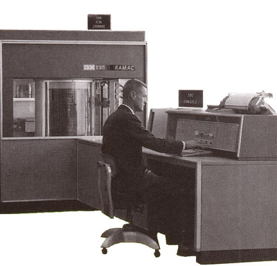

This page intentionally left blank. ⬇️, ➡️, or spacebar 🛰 to start slidedeck.
---
class: center, middle

# Welcome to Class 14!

---

# Agenda

- Questions?
- News of the Week
- Readings
- Break!
- Databases

---
## Assignment questions?

### Other questions?

---

## News of the Week

Drop a link on the etherpad:
<https://etherpad.wikimedia.org/p/prattsi654fa21-14>

---
class: middle, center

# Break!

---
class: center, middle

# Databases 🥞

---

[The best database webcomic ever drawn](http://nedroid.com/2012/05/honk-the-databus/)

---
# Databases

A database is an organized collection of data that can easily be accessed and modified. 

By this broad definition, a list is a database. An Excel spreadsheet is a database. Everything is a database!

.right[]

---
# Databases

Before we get too deep into databases, a slight historical view... 

--

... but why do they look like that?

---

# Databases

---

# Databases

From our API class:
- Static data
- Flowing data
- Meaningful data

From the readings:
- Raw Text
- Structured Text (CSV)
- Tree-based structure (XML, JSON)
- The Relational model

---

# Databases

What are examples of databases with which you interact in daily life?

--

What are some of the largest databases out there?

---
# DBMS 

*Database Management System* 

But usually, when using the word "database," someone is referring to an entire database system. 

Examples of DBMS are Microsoft Access, FileMaker, or Oracle, MySQL, PostgreSQL and Microsoft SQL Server.

--
 
(aspects of this are similar in some ways to the content management system properties we discussed last class)

.right[]

---
# Relational Databases

All of the previous examples were types of relational database framework. This relational model has been extremely popular since it was invented in the 1970s and is probably what people mean or are using when they talk about a database.   

A relational database is a collection of schemas, tables, queries, reports, views, and other elements.

.right[]

---
# The relational model

We have a bunch of books.
What basic info do we have?

--

Let's say: 

- Author
- Title
- ISBN
- Publisher
- Date
- Edition

--

How do we break this apart so that we're not duplicating a ton of data?

---

# The relational model

Break it into (at least) two tables: 

**AUTHOR**
- *AuthorID*
- FirstName 
- LastName

**BOOK**
- *ISBN* 
- Title 
- Copyright
- Publisher
- (FK: AuthorID)

---

# The relational model

Then, we can link elements of the two tables together to get the view we are likely most interested in:

- *AuthorID*
- FirstName
- LastName
- Title
- *ISBN*

---

# The relational model

Then, we can link elements of the two tables together to get the view we are likely most interested in:

- *AuthorID* (from `author` table)
- FirstName (from `author` table)
- LastName (from `author` table)
- Title (from `book` table)
- *ISBN* (from `book` table)

---

# Keys

- Primary key
- Foreign key

Every foreign-key value must appear as another table’s primary-key value

---

# Keys: Types of relationships

- One-to-one

- One-to-many

- Many-to-many

---

# Keys: Types of relationships

- One-to-one (Social security #s, passport numbers, drivers license, License plates, etc.)
- One-to-many (Artist/paintings fits well into this model)
- Many-to-many (authors and articles – both can have many to many, ditto artists/compositions)

---

# Keys: Types of relationships

Diagram: WordPress Database Schema
https://codex.wordpress.org/images/9/9e/WP3.0-ERD.png

---
# How do databases work technically? 

[This article](http://coding-geek.com/how-databases-work/) does a great job at in-depth explanations of how databases work. Here is an overview of some of the significant components of a database:  

- Process manager
- Network manager
- File system manager
- Memory manager
- Security manager
- Client manager
- Backup manager
- Recovery manager
- Monitor manager
- Administration manager
- Query manager
- Data manager

---
# How do databases work? 

That's a lot of management! And many of the components do multiple tasks. Databases are doing a lot of work so that you don't have to.

.right[]
---
# (Very) basic pattern of interaction 

- You deliver a command to the database, probably written or parsed down into SQL (more on that later)
- The client manager determines if you are allowed to do that 
- The query manager checks your statement and optimizes it (determines the fastest way to get the answer)
- The hunt begins! (A lot of complex things happen here, computers doing computer stuff)
- The answer is returned to you, the user

---
# CRUD 

The four basic functions of persistent storage.  

**C** reate  
**R** ead  
**U** pdate  
**D** elete  

---
# ACID 

*Atomicity, Consistency, Isolation, Durability*

**A** tomicity: each transaction be complete fully or not at all; no partial transactions.    
**C** onsistency: any transaction will bring the database from one valid state to another.  
**I** solation: if multiple transactions occur, they must have the same result regardless of order.  
**D** urability: once a transaction has been committed, it will remain so, even if there's a crash or error.

---

# Interlude: Little Bobby Tables

https://xkcd.com/327/

---
# SQL 

*Structured Query Language*

A way to talk to databases using simple but powerful, declarative statements. 

It can be very finicky and frustrating, but appreciate all the work a database is doing for you!

Here are some major elements used in composing statements: 

- SELECT
- FROM
- WHERE
- ORDER BY

---
# SQL 
Commands look like this:  

`SELECT * FROM Cats`: returns everything in the Cat table.  

`SELECT Name FROM Cats WHERE Status = 'Kitten'`: returns the names of all cats with a kitten status.  

Maybe you forgot to make a kitten status when you designed your database, but you do have all the cat birthdays. You can do something like this:   

`SELECT Name FROM Cats WHERE BirthDate >= 2021-01-01` to find all cats born in the year 2021.  

---
# SQL 

Honestly, I find writing raw SQL statements to be a total nightmare and it feels impossible to get the syntax exactly right, which is made more frustrating by the syntax seeming to be so simple. A lot of database systems or interaction languages exist to translate SQL on your behalf, so you can more naturally tell the computer what you want. 

---
# NoSQL 

Some databases are "NoSQL" and work differently from relational databases. 

Example frameworks:  

- CouchDB 
- MongoDB 
- Redis 

