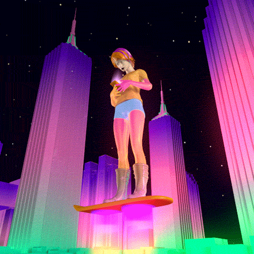
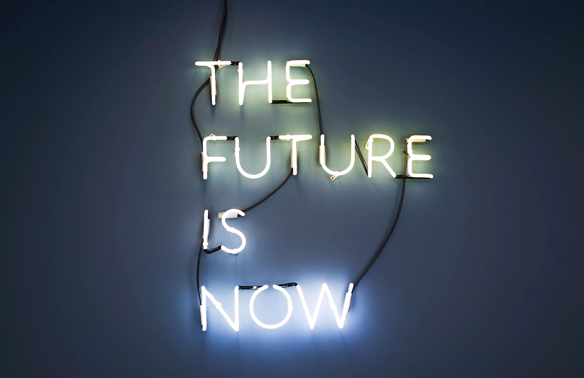
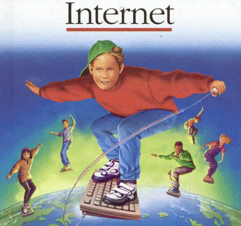

This page intentionally left blank. ⬇️, ➡️, or spacebar 🛰 to start slidedeck.
---
class: center, middle

# Welcome to Class 15!
--

`<sniffle>`The Last class! `</sniffle>`

---

# Agenda

- Housekeeping
- (Final!) News of the Week
- Readings – what connections did you make?!
- What inspired you?
- Future of Libraries, Museums, Design, and Consumer Tech!
- Thoughts for next semester?
- Last speech
- Class evaluations

---
## Housekeeping

### Final assignments in our inboxes!

### Other questions?

---

## News of the Week

Drop a link on the etherpad:
<https://etherpad.wikimedia.org/p/prattsi654fa20-15>

---
class: middle, center

# Readings

---
class: middle, center

# Break!

---
class: middle, center

# The Future!

---
class: middle, center

---

## Let's compare notes

-	What are the most exciting/compelling technology things you’ve encountered this semester?

--

- What are the most worrisome technology things you have seen this semester?

---

## Looking toward the professions

- What do you think are the most important or innovative profession-related technologies you've seen this semester?

--

- What technology are you most excited about to dig into a bit deeper?

---

# Thoughts for next semester?

- What suggestions would you make to improve the experience for your peers, either next semester or a year from now?

---
class: center, middle

# Last speech

---
class: center, middle

# Class evaluations

